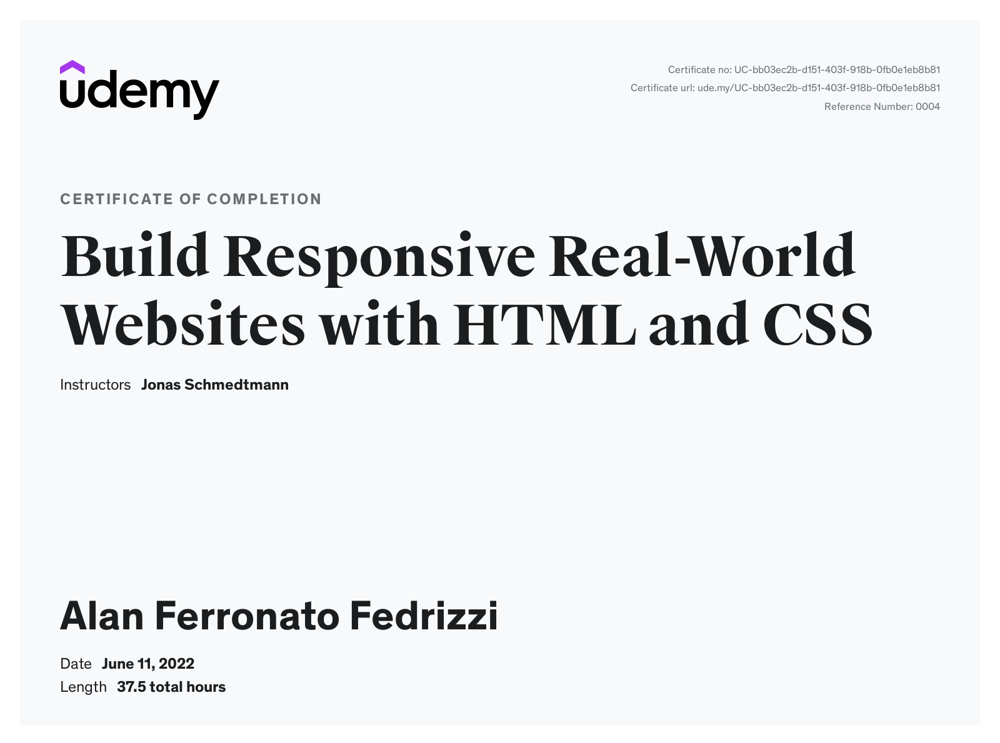

# Build Responsive Real-World Websites with HTML and CSS

Online Course [Build Responsive Real-World Websites with HTML and CSS](https://www.udemy.com/course/design-and-develop-a-killer-website-with-html5-and-css3/) by [Jonas Schmedtmann](https://www.udemy.com/user/jonasschmedtmann/) on [Udemy](https://www.udemy.com/).

